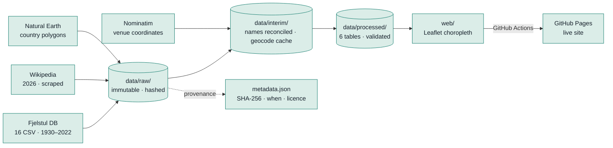

# Atlas Copa do Mundo — World Cup Atlas

An interactive map of every FIFA World Cup, 1930–2026, built as an end-to-end data
pipeline: extraction (including web scraping), reconciliation of almost a century of
inconsistent records, relational modelling, validation, and publication.

*Documentação de planejamento em português: [`plano-atlas-copa-mundo.md`](plano-atlas-copa-mundo.md)*

> ### Status: stage 5 of 5
> The pipeline runs end to end, **the map works**, and it is published —
> **[alaindelon96.github.io/atlas-copa-mundo](https://alaindelon96.github.io/atlas-copa-mundo/)**.
> Locally: `python serve.py`. This README describes what is
> built, not what is planned — see [Roadmap](#roadmap).

---

## What this repository actually contains today

| | |
|---|---|
| **Working** | Extraction with cryptographic provenance, a Wikipedia scraper for 2026, a reconciled match table, a validated 6-table model, an interactive choropleth map with match detail, two-team comparison, a venue layer, an all-time scorer table with a page per player, a screen per World Cup, searchable team pickers, ready-made questions and shareable URLs — deployed to GitHub Pages by a workflow |
| **Data on hand** | `data/processed/` — 1,068 men's matches, 3,028 goals with scorer and minute, 23 tournaments, 83 teams, 208 geocoded venues, 1930–2026. Schema: [`docs/schema.md`](docs/schema.md) |
| **Not built yet** | Scheduled re-runs of the pipeline in CI — deferred to v2 |
| **Known gap** | Attendance exists only for 2026 (Fjelstul carries none) — and is deliberately not a feature |
| **Scope** | The men's World Cup. The women's data is extracted and cleaned but excluded from the model and the map — see [Scope](#scope) |

---

## Quickstart

The raw data is **not** in this repository. That is deliberate: it is reproducible
from the code, and reproducing it is verifiable. Clone, install, extract:

```bash
git clone https://github.com/alaindelon96/atlas-copa-mundo.git
```

```bash
pip install -r requirements.txt
```

```bash
python -m etl.extract
```

That downloads 16 CSVs (~1.9 MB) into `data/raw/fjelstul/` and writes a provenance
record to `data/raw/metadata.json`.

To check whether the upstream source has changed since your last download, without
overwriting anything:

```bash
python -m etl.extract --check
```

Then fetch and parse the 2026 tournament, which no dataset covers:

```bash
python -m etl.scrape_2026
```

```bash
python -m etl.parse_2026
```

**This has been verified**: a fresh clone followed by `python -m etl.extract`
reproduces all 16 files with SHA-256 hashes identical to the committed provenance
record. The data is not stored; it is *regenerable*, and the hashes prove the
regeneration is byte-identical.

Then build the model, validate it, and generate what the map loads:

```bash
python -m etl.transform && python -m etl.geocode --offline && python -m etl.geo
```

```bash
python -m etl.model && python -m etl.validate && python -m etl.metrics
```

`--offline` replays the committed geocoding cache and never touches the network. Drop it
only if you intend to re-query Nominatim — that is ~5 minutes at 1 request/second.

---

## How the pipeline works

Data flows in one direction only. Nothing ever writes backwards into a folder to its
left — that single constraint is what makes the whole thing reproducible.



### Stage 1 — Extract ✅

Downloads the source CSVs once, stores them untouched, and records exactly where each
came from.

| Module | Responsibility |
|---|---|
| [`etl/paths.py`](etl/paths.py) | Every path resolved from the repo root, so any module works regardless of the working directory |
| [`etl/provenance.py`](etl/provenance.py) | SHA-256, UTC timestamp, URL, licence and attribution for each file |
| [`etl/extract.py`](etl/extract.py) | The download itself |

Three decisions here are worth explaining, because they are the difference between a
script and a pipeline:

- **`data/raw/` is immutable.** Nothing in it is ever hand-edited, and it is
  `.gitignore`d — but `metadata.json` *is* committed. The data is disposable; the
  audit record is not.
- **Writes are atomic.** Each file lands as `.part` and is renamed only on success. An
  interrupted download cannot leave a truncated CSV that looks valid.
- **Everything is hashed.** `--check` compares the remote hash against the recorded one
  without overwriting, so you can detect upstream changes. This is the hook that makes
  scheduled automation possible later.

### Stage 1b — Scrape 2026 ✅

No published dataset covers the 2026 tournament, so it comes from Wikipedia.
Scraping and parsing are **separate modules**, deliberately:

| Module | Responsibility |
|---|---|
| [`etl/scrape_2026.py`](etl/scrape_2026.py) | Fetches raw HTML into `data/raw/scraped/`. Nothing is interpreted. |
| [`etl/parse_2026.py`](etl/parse_2026.py) | Reads that cached HTML and extracts data. **Makes no network requests.** |

Splitting them means a parsing bug can be fixed and re-run instantly without
touching Wikipedia again, the parser is testable offline, and the cached HTML is
evidence of what the page said at collection time.

**Compliance**, since scraping has rules worth following:

- Wikipedia's `robots.txt` disallows `/w/` and `/api/` for generic agents but
  permits articles at `/wiki/<Title>` — which is what this fetches. The REST API
  would *not* have been allowed.
- Identifiable user-agent with contact details, per Wikimedia policy.
- One second between requests.
- The **revision ID** of every page is recorded. Wikipedia changes constantly, so
  naming the article is not sufficient attribution — see
  [`LICENSE-DATA.md`](LICENSE-DATA.md).

The 104 matches are spread across 14 pages: 12 group pages (6 matches each) plus
the knockout stage (32). The parser verifies itself against the article's own
declared totals and **refuses to succeed if they disagree**:

```
OK  partidas   extraído=104    infobox=104
OK  gols       extraído=308    infobox=308
OK  sedes      extraído=16     infobox=16
```

Attendance independently sums to 6,810,966 across 104 matches — matching the
infobox exactly, average included.

### Stage 2 — Clean and reconcile ✅

Merges both sources into `data/processed/matches_clean.csv` — 1,352 matches, 1930–2026.

```bash
python -m etl.transform
```

Three ideas carry this stage:

**Label and record are different questions.** [`reference/team_succession.csv`](reference/team_succession.csv)
has two separate columns: `display_name` (how the team is shown today) and
`merge_records` (whether its history is credited to the successor). West Germany gets
both — it becomes Germany *and* its titles count. The USSR gets only the first.

> **Corrected in stage 3.** That last sentence used to end "…and keeps its own record."
> `pandera` showed it was not true: `apply_succession` applies `display_name` to
> everyone, so **match** records always followed the label — only the **title** count
> respects `merge_records`. No headline number was wrong, because no entity treated this
> way ever won a World Cup; the description was. Faced with the choice, the project
> reaffirmed the behaviour — the label governs — and made the consequence visible instead
> of hiding it. See [Stage 3](#stage-3--model-geocode-and-validate-) and
> [`docs/schema.md`](docs/schema.md).

**Fuzzy matching suggests; it never decides.** `rapidfuzz` reports names in 2026 that
have no historical counterpart, for a human to classify. It is deliberately not allowed
to merge anything, and the data shows why:

```
Cape Verde       closest: Cuba    60.0   debut?
Curaçao          closest: Cuba    67.5   debut?
Jordan           closest: Iran    67.5   debut?
Uzbekistan       closest: Iran    60.0   debut?
```

Four genuine World Cup debutants — and **DR Congo is absent from that list**, because
the curated map already resolved it to Zaire, which played in 1974. `fuzz.WRatio("Zaire",
"DR Congo")` scores under 50. The only real succession between the two sources is
precisely the one string similarity could never find.

**Champions do not come from finals.** The 1950 World Cup had no final — it was decided
by a final round-robin group. Deriving champions by filtering `stage == "final"` returns
22 titles for 23 tournaments and raises no error. So champions come from the source's own
standings table instead, and the pipeline asserts that titles sum to the number of
editions.

Stage 2 also normalises stage names, which were inconsistent *within* Fjelstul itself —
`quarter-final` (32 rows) alongside `quarter-finals` (70).

### Stage 3 — Model, geocode and validate ✅

```bash
python -m etl.geocode --offline && python -m etl.geo
```

```bash
python -m etl.model && python -m etl.validate && python -m etl.metrics
```

Six tables in `data/processed/` — `tournaments`, `tournament_hosts`, `teams`, `venues`,
`matches`, `team_matches` — plus the two JSONs and the GeoJSON the front-end loads. The
ERD and the reasoning behind every schema decision are in [`docs/schema.md`](docs/schema.md).

Note the order: `etl.geo` writes the `reference/team_country.csv` that `etl.model` reads.

**Geocoding.** All 252 venues in the data resolved through Nominatim at 1 request/second, with the
responses cached on disk *and committed*. `--offline` replays that cache and never touches
the network — reproducing the pipeline should not cost a free public service five minutes
of traffic. The query descends in steps (`stadium, city, country` → `city, country` →
`stadium, city`) and the step that answered is kept in `venues.match_level`, because 51 of
the 252 coordinates point at a city centre rather than a pitch, and a marker layer needs to
know that.

This is what filled `country_name` for the 104 matches of 2026, which the Wikipedia tables
never carried. That unblocked "matches received" — and added **Canada** as the 19th country
ever to host a men's World Cup match.

**Country polygons.** The map shades countries, so it needs shapes, not points. The base is
Natural Earth's `admin_0_map_units` rather than `admin_0_countries`, and the difference
decides the project: only `map_units` separates England, Scotland, Wales and Northern
Ireland, which is the split football uses. The price is that the same division splits
**Belgium** into Flanders, Wallonia and Brussels — so `reference/team_country.csv` is
one-to-many, 88 polygons for 86 teams. The three Belgian regions take the same colour and
the seam does not show.

**Validation.** `etl/validate.py` declares each table's contract in `pandera` and checks
what is *on disk*, without recomputing it. It earned its place immediately. The checks the
scripts already ran verify **totals** — "do the goals add up?" — and are therefore blind to
row-level error. Declarative validation found two sentinels no sum would ever flag:

| Column | Fjelstul writes | Wikipedia writes | Rows |
|---|---|---|---|
| penalty score, no shootout | `0` and `0` | blank | 1,205 |
| `group_name`, knockout stage | `"not applicable"` | blank | 332 |

Neither breaks anything, and that is the problem. `0` is a valid score, and a `groupby` on
group would happily return a "group" called `not applicable` holding 332 knockout matches.
Both are real nulls now.

It also caught something sharper: **the project's own documentation was wrong.** Stage 2
claimed that teams with `merge_records=0` kept separate records. They did not — only the
title count respected that flag; match records always followed the display label. No
headline number was affected (none of those entities ever won a World Cup), but Russia
shows 53 matches of which 22 are Russia's. Faced with the choice, the project kept the
behaviour — **the label wins** — and made the consequence loud instead of hidden:

> **1974, East Germany 1–0 West Germany** becomes `Germany × Germany`. Germany books one
> win and one loss, one goal for and one against; every total still balances. `etl.validate`
> prints the case on every run and a test locks it, so nobody "fixes" an editorial decision
> by accident.

### Stage 4 — The map ✅

```bash
python serve.py
```

Then open http://localhost:8000. The page needs a real HTTP server: opening
`index.html` off disk trips the browser's origin policy and the JSON fetch fails — the
page tells you so if it happens.

[`serve.py`](serve.py) exists for one line — `protocol_version = "HTTP/1.1"`. The
obvious `python -m http.server --directory web` served everything except the file that
matters most: `SimpleHTTPRequestHandler` speaks HTTP/1.0 and closes the connection after
each response, the page requests eight JSON payloads in parallel and reuses connections,
and on Windows the combination dropped `countries.geojson` (1.7 MB) mid-transfer —
`ERR_CONNECTION_RESET` after ~19 s, truncated. The map opened with no countries on it
and nothing in the console pointing at the server.

| File | Role |
|---|---|
| `web/index.html` | The shell: a full-window map with the panels floating over it |
| `web/map.js` | Aggregates, classifies, paints — and checks itself against the pipeline |
| `web/style.css` | The chrome: palette, typography, scoreboard, cards — see Stage 4e |
| `web/vendor/` | Leaflet 1.9.4, 83 flag SVGs and the Archivo variable font, vendored rather than pulled from a CDN |
| `serve.py` | Local HTTP/1.1 server — the stock `http.server` truncates the 1.7 MB GeoJSON |
| `web/data/` | Everything the page fetches — 2.1 MB, of which `countries.geojson` is 1.7 MB |
| `etl/color.py` | Turns a shirt colour into a sequential ramp, in OKLab |
| `reference/team_colors.csv` | Each team's curated colour, with the exceptions reasoned |
| `reference/team_names.csv` | Each team's Portuguese name, article and FIFA trigram, with the editorial calls reasoned |

**The year slider cost a rule, so the rule became a check.** Every other number on the
map is pre-computed in Python, on the principle that a wrong number is always an ETL
bug. A free year range breaks that — 23 editions give 276 possible ranges, so the
browser has to do the arithmetic. Rather than quietly duplicating the metric
definitions in JavaScript, the duplication is made loud: `etl.metrics.aggregate_timeline`
is the reference implementation, `web/map.js` mirrors it, and **the page re-runs the
full 1930–2026 range on load and compares it to `metrics.json` team by team**. Diverge,
and a red banner says the numbers cannot be trusted. A Python test locks the other side.

**The map is painted in the selected team's shirt colour.** Pick Brazil and the world
turns yellow; Italy, azzurro; the Netherlands, orange. The rule is precise: **the home
shirt of the last World Cup that team actually played**, curated by hand in
[`reference/team_colors.csv`](reference/team_colors.csv). For 48 of the 83 teams that is
2026, so it rarely bites; it bites for the nine who have not played since before 1998 —
Cuba's 1938 red, Israel's 1970 blue, Kuwait's 1982 blue.

The `last_cup` column is **checked against the model on every run**, so a team playing
again cannot leave the colour quietly describing a kit that is no longer their last. That
check caught two curation errors the first time it ran: Italy (last played 2014, not
2026) and Peru (2018).

Sixteen sides play in white or black, which cannot carry a ramp — white has no hue, and
black becomes the same grey that means "no data". Those fall back to the chromatic colour
that identifies them, marked `identity` and reasoned row by row. The Dutch East Indies are
the sharpest case: they played 1938 in white, so the row uses modern Indonesia's red — the
label the record appears under.

`etl/color.py` turns each of those colours into a nine-step ramp in **OKLab**, a
perceptually uniform space — interpolating yellow to white in sRGB detours through dirty
beige. Lightness carries the data and moves monotonically, which is what keeps the ramp
readable without colour vision; when a step falls outside sRGB, chroma gives way rather
than the RGB channels, because clamping a channel would drag the hue and land the yellow
on orange. The **global view keeps one ramp on purpose**: the eye reads darkness as
quantity, so giving every country its own colour would make a dark-blue Italy look like
more than a brighter Brazil with a bigger number.

**Three further colour decisions the data forced:**

- **The scale is continuous, with a square root.** Brazil has 247 goals and half the
  teams have fewer than ten; a linear continuous scale crushes almost everyone into the
  first tenth of the ramp. The root opens the bottom out without inverting any ordering.
  What it distorts is proportion — so the legend marks real values at `sqrt(v/max)`, and
  the marks visibly bunch up on the right.
- **Two metrics get a diverging ramp** (red ↔ blue) with two *fixed* poles, even when a
  team is selected — if the positive pole followed the team's colour, "negative" would
  change colour with every country. Goal difference pivots on **0**, win percentage on
  **50%**: both have a middle that means something, and a sequential ramp erases it, since
  49% and 51% become two near-identical shades of one hue. The pivot is declared per metric
  (`pivot` in `METRICS`), and the extent is measured *from it* — measuring win percentage
  from zero would push the whole distribution onto one arm of the bar.
- **Zero and "no data" are different colours.** China, Trinidad and Tobago, and Zaire in
  1974 have never scored a World Cup goal. That is a fact worth showing, not an absence
  — which is why the weakest step of every ramp keeps a trace of the hue instead of
  fading to the no-data grey.

### Stage 4b — Four features the existing data already paid for ✅

None of these needed a new source. The design reference was **SofaScore**, whose team page
is built on a match list with a W/D/L marker per row, a form summary and a compare button.

| Feature | What it fixes |
|---|---|
| **State in the URL** | The view becomes a link. Without it, "Brazil against Sweden between 1958 and 1970" is a set of instructions for a human to execute by hand. It also gives the browser's back button a meaning on a page that never changes page. |
| **Match detail** | The map said *how many* and never *which*. Click a fixture and the matches behind the number open up: date, edition, stage, score, venue, result marker. New payload `web/data/matches.json`, 58 KB, all 1,068 matches. |
| **Two-team comparison** | Head-to-head only answers for teams that have met. A side-by-side comparison works for teams that never have — and says so explicitly instead of showing zeros. Each row declares its direction, because in goals conceded the winner is the *lower* number. |
| **Venue layer** | Returns the 252 venues stage 3 geocoded and the map never used. The choropleth aggregates to the country; the layer shows **where**. The count respects the year filter — 208 venues over the full range, 16 in 2026. |

**Three decisions the data forced:**

- **Penalties do not produce draws — not in the detail list either.** `etl.model` resolves
  the 39 shootouts into a win and a loss. The JavaScript has to apply the same rule, or the
  list shows "D" directly beneath a panel saying 82 wins. A test recomputes the totals from
  `matches.json` and compares them to `metrics.json` — the map's self-check, one level down.
- **The two venue lists must stay in the same order.** The front-end takes a match's venue
  index and uses it to find the coordinate in the layer. The first version sorted the layer
  by match count and broke that **silently**, because both lists stay the same length. It is
  a contract now, asserted in the ETL and in a test.
- **The URL stores only what differs from the default**, so an untouched view gives back a
  clean `#` rather than a paragraph of redundant parameters, and `replaceState` keeps every
  slider step out of the history.

Two silent bugs surfaced on the way and became fixes: `badge()` escaped the single quote but
not the double one in the flag's `onerror`, which closed the attribute early and leaked `'">`
as text next to the team name — live since the flags commit; and `styleFor()` still asked for
two CSS variables that the restyle had removed, so the selected country came through unfilled.

A third one showed up later and was not silent at all: **hovering a country made the venues
disappear for good.** As `circleMarker`s the venues were vectors in the *same* `overlayPane`
as the countries, so the `bringToFront()` that draws the hover outline reordered the whole
SVG and buried them — and because the order was now written into the tree, mouseout could not
undo it. The venues are `divIcon` pins now, in the `markerPane` (z-index 600 against the
overlay's 400), which makes the overlap impossible rather than recoverable. The marker is a
red map pin instead of a circle, for a reason beyond taste: on this map a circle already means
*quantity* (area ∝ matches), and a venue is not another value on the choropleth — it is a
place. Its tip, not its centre, sits on the coordinate.

**Every pin is the same size.** Scaling it by match count is the obvious move and it costs
more than it returns here: 208 venues bunch up wherever the World Cup came back — Europe and
Mexico read as one clump — and the big pins bury the small ones, hiding exactly the venues the
layer exists to show. The count stays where it is exact, in the tooltip.

The pin's colours live in the SVG as `fill:var(--pin,#E01B24)`, with the literal as a fallback.
That is not belt-and-braces: an SVG with no resolved `fill` falls back to **black**, and one
cached stylesheet already turned all 208 pins black without a single console error.

### Stage 4c — Top scorers, and the assumption that fell ✅

**Stage 3 concluded that player-level data would have a hole in 2026, and cut the project's
features down to "match statistics only".** The conclusion was right about Fjelstul, which
stops at 2022, and wrong about what was already on disk: the pages `scrape_2026.py` had
downloaded carry the scorers, with minutes. All 104 match boxes were checked — **308 minute
marks**, exactly the total the article declares, and the 7 matches with no name listed are
all 0–0. The hole never existed; a parser was missing.

| | |
|---|---|
| Fjelstul, 1930–2022 | 2,720 goals with scorer, minute, penalty and own-goal flags |
| Wikipedia, 2026 | 308, parsed from HTML already sitting in `data/raw/scraped/` |
| **Total** | **3,028** — the same number the model's scorelines already produced |

That meeting is what makes the table **checkable** rather than plausible: it does not invent
a count of its own, it reproduces one the model already produced by another route — and the
check is per match, not just on the total.

- **An own goal is credited to the team that gained it**, as in the scoreline; `player_team`
  holds the team of whoever kicked it. If `team` were the player's team, two sides would have
  each other's number in the same match.
- **Reading by list item lost 6 goals in 302.** Most columns wrap each scorer in an `<li>` —
  but not all, and one carried two players in loose text. The parser now walks the minutes and
  treats the text between them as a change of player, which holds in both formats. What caught
  the error was the check against the declared total, not the parser checking itself.
- **Player names are not comparable across the sources.** Fjelstul writes the string
  `"not applicable"` in the first-name field of anyone who has only one — the Brazilian Ronaldo
  among them. Top scorer per edition is safe; a career summed across the two sources is not,
  and the project does not promise it.

On screen: each match's scorers in the detail view (the 1958 final comes out with Vavá, Pelé
and Zagallo at the right minutes), a scorer list for the selected team (Ronaldo 15, Pelé 12 for
Brazil; Mbappé 10 in 2026), and a **play button on the slider** that walks the window across the
editions keeping the chosen width — which is why it skips 1942 and 1946, which never happened.

### Stage 4d — The page speaks Portuguese ✅

The interface was written in pt-BR from the first commit and the country names were not:
the panel read "Germany" next to "Gols marcados". The fix is a label layer, not a rename —
**the key stays English everywhere** (`team` in the GeoJSON, the `timeline.json` indices,
the `t=` parameter in the URL), so links already shared keep opening the view they describe
and no join has to translate back. `pt()` appears in output only: tooltip, table, picker.

The 83 names are curated in [`reference/team_names.csv`](reference/team_names.csv) and
shipped as `web/data/names.json` (4 KB). Natural Earth's `NAME_PT` was the obvious shortcut
and it does not fit: it names *countries*, and the data names *teams* — "Republic of
Ireland" and "Chinese Taipei" are not country names, and Belgium is three map units called
Flandres, Valônia and Bruxelas, none of which is the team. It is also European Portuguese
in places (Chéquia, Irão) on a pt-BR page.

- **The article is part of the name.** Portuguese contracts it: ***na** Suécia*, ***no**
  Japão*, but *em Portugal*. It cannot be derived, so the CSV carries a column for it and
  the ETL rejects anything that is not `o`, `a`, `os`, `as` or empty. It fixes the away line
  in the match list, which read "em Suécia", and the legend, which read "Estados Unidos
  aparece".
- **Sorting moved to the label.** `localeCompare` without a locale uses the browser's, and in
  an English one "Áustria" lands after "Uzbequistão". The picker and the rankings order
  through an explicit pt-BR collator.
- **One sentence lost its participle.** The legend said "*Alemanha aparece contornada*",
  which agreed in gender with the team and was already wrong for Brasil, Japão and Catar.
  Rewritten without it, only number has to agree — and that comes from the article.
- **Two teams cannot share a label.** Republic of Ireland and Northern Ireland are separate
  teams with separate polygons; shortening both to "Irlanda" would merge them on screen
  without merging anything in the data. The ETL raises on a repeated name, and a test locks it.

Editorial calls are reasoned in the CSV's `note` column, as in `team_colors.csv`: Netherlands
is **Holanda**, the name Brazilian sports press uses and the one the repository's own comments
already used; Republic of Ireland is plain **Irlanda**, unambiguous because Northern Ireland
is its own polygon; Czech Republic is **República Tcheca**, the Brazilian spelling.

### Stage 4e — The interface speaks football ✅

Speaking Portuguese was not the same as *looking* like something a Brazilian football
fan would open. The page was a data atlas — emerald accent, monospaced small-caps
labels, no masthead at all, because the `<h1>` was screen-reader only on the theory that
the map is its own title. That works for a reader who already knows where they landed
and fails for everyone arriving from a shared link.

The three references the audience actually uses solve it the same way, with the same
palette:

| | Chrome | Accent | Live |
|---|---|---|---|
| **ge.globo** | green `#06AA48` navigation bar | uppercase editoria kickers | red `AO VIVO` tag |
| **Lance!** | green `#00A021` header, `#007A17` in text | pure yellow highlight | `#E3262E` real-time |
| **CazéTV** | structural black | yellow as the mark | — |

The common denominator is **green, yellow and black** — the national team's own
palette — plus a scoreboard card with a three-letter code, and small-caps kickers set in
condensed bold rather than monospace. This stage adopts all of that, with three
decisions the map itself forces:

- **The masthead is black, not green.** Half this screen is coloured data, and several
  teams *are* green (Nigeria, Algeria, Mexico, Saudi Arabia). A green bar above a map
  that sometimes goes green reads as part of the scale. Green and yellow go into the
  wordmark, into a 3px rule under the bar, and into active states — never into a large
  area. The 3px rule is the only place the two appear together at full strength.
- **Two greens, and the difference is a contrast rule.** `--accent` (`#00843A` light,
  `#00D45F` dark) is the one allowed to carry text — 4.8:1 under white. `--accent-vivid`
  (`#00A83F`) is the flag green, too bright for small text at 3.4:1, and reserved for
  pure mark: the logo, the rule, the slider fill.
- **The self-check warning became a yellow card.** In football, yellow is precisely what
  that panel means — a caution, play continues. The page has not stopped working when it
  appears; it is reporting that a JavaScript sum drifted from the Python one.

Two things changed in the data layer, not just the paint:

**Every team gained its FIFA trigram** — a `sigla` column in
[`reference/team_names.csv`](reference/team_names.csv), shipped in `names.json`. It is
curated, not derived: three letters off the Portuguese name would give `ALE` for
Alemanha and `HOL` for Holanda, neither of which has appeared on a World Cup screen, and
`SUI` for both Suíça and Suécia. The ETL rejects a code that is not three capitals and
raises on a collision — two teams sharing a trigram would be two identical scoreboards
with different results, and a trigram is too short for anyone to notice.

**A match row became a scoreboard**, and that changed which side is which. The old row
read from the selected team's point of view — `4–1 vs Itália` — which gives the same
match two different scorelines depending on how you reached it: the 1970 final is `4–1`
from Brazil and `1–4` from Italy. The card now shows home on the left and away on the
right, always, with each side's scorers in its own column underneath. The *result*
stays the selected team's, because that is the question the list answers, and it is
carried by both a coloured rail and a letter — `V`, `E`, `D` — never by colour alone.

The typeface is **Archivo**, vendored as a variable font with both axes (width 62–125,
weight 400–800) in one file, so the same family sets body text at normal width and
scoreboards, trigrams and kickers in condensed heavy. It ships under SIL OFL 1.1 in
[`web/vendor/fonts/`](web/vendor/fonts/), on the same terms as Leaflet and the flags: a
clone renders offline and the version in git is the version on screen.

**One bug surfaced while checking the two themes, and it predates this stage.** Swapping
themes changes ~35 colour tokens at once, and Chrome treats that as the start of a
transition on every property that declares one over a `var()` — then resolves the wrong
end value and leaves it there. After a single click on the theme button, the pressed
`Total` button kept the *light* theme's green and white on a dark panel, and all three
`select`s kept a light grey border; nothing recovered without a reload. The fix suspends
transitions for two frames across the swap (`:root.theming`), on the button and on the
`prefers-color-scheme` listener, which has the same problem and does not go through the
button.

### Stage 4f — Doors into the data ✅

Stage 4e repainted the page; it did not redesign it. The interaction model was
still **metric-first**: pick `goal_difference`, pick `per match`, pick a year
range. That asks you to already know what the page can answer. A fan does not
arrive that way — they arrive with a question already formed, and the three
things they ask first were all reachable and none was *offered*.

Three changes, all inside the existing state model:

**The two team pickers became search boxes.** They were `<select>`s with 83
countries in alphabetical order, which you navigate by scrolling: the native
type-ahead of a `<select>` matches a prefix only, is invisible, and expires after
a second. The box now matches anywhere in the Portuguese name, the FIFA trigram
and the English key, and ignores accents — `kor`, `coreia` and `korea` all reach
Coreia do Sul, and each row carries its flag. It is a real ARIA combobox with
arrow keys, Enter, Escape and a clear button.

> The list is appended to `<body>` and positioned in viewport coordinates, which
> is not a stylistic choice: the controls card needs `overflow` to scroll on a
> short window, so anything absolutely positioned inside it gets clipped at the
> border — the list showed a line and a half. And `position:fixed` inside the
> card would not have helped either, because `.hud` has a `backdrop-filter`, and
> that makes an element a containing block for its fixed descendants.

**The landing screen now asks the questions for you.** Six tags — *Maiores
campeões · Melhor aproveitamento · Brasil × Argentina · A Copa de 1970 · Só o
século XXI · Onde se jogou* — each of which is a real `<a href="#…">`. The URL
already described the whole state and `applyURL` already treated a missing
parameter as a reset, so a tag is just a link: it costs no new code path, it
enters browser history, the back button works, and it can be copied. It is the
cheapest way to teach that the metric picker, the year range, the comparison and
the venue layer exist at all.

**The three headline numbers became football.** They read *83 seleções · 23
edições · 83 no mapa* — two of which describe the dataset, not the sport. They
are now *Edições · Partidas · Gols*, followed by three facts that answer
questions someone would ask out loud, and all of them follow the year slider:

| Range | Most titles | Top scorer | Biggest win |
|---|---|---|---|
| 1930–2026 | Brasil (5) | Ronaldo (18) | HUN 10×1 SLV, 1982 |
| 1930–1958 | Itália · Uruguai (2) | Just Fontaine (13) | HUN 9×0 KOR, 1954 |
| 1994–2006 | Brasil (2) | Ronaldo (15) | GER 8×0 KSA, 2002 |
| 2018–2026 | Argentina · Espanha · França (1) | Kylian Mbappé (12) | ESP 7×0 CRC, 2022 |

Ties are the common case, not the exception — in any short range several teams
have one title each, and showing only the first would elect a "biggest champion"
by scan order. That last row is the reason: it used to read *França*, silencing
Argentina and Spain, who won the other two.

**Replacing the `<select>` surfaced a line that had been harmless for two
stages.** `syncMetricOptions` — whose job is the *metric* options — ended by
also writing `picker.value = state.team` into the team picker. On a `<select>`
that set an option by its value and did nothing visible. On a text input it
wrote the raw English key on screen: the box read **South Korea** while the
panel beside it read **Coreia do Sul**. The line was redundant either way;
`select()` and the `hashchange` listener both already sync the box.

### Stage 4g — The player becomes a person ✅

The goals table had carried scorer and minute since stage 4c, and the interface
spent them on one thing: eight names inside a team's panel. There are **3,028
goals and 1,624 scorers** in the browser. This stage gives the player a screen —
an all-time table, and a page per player with their goals grouped by tournament.

Building it turned up a bug in the number that was already on screen.

**The all-time top scorer was wrong, and it was wrong by construction.** The
scorer tally was keyed by *name*, and a name is not a person. The landing screen
announced **Ronaldo, 18 goals** — a record that has never existed. It was the
Brazilian Ronaldo (15 goals, 1998–2006) plus a Portuguese Ronaldo who scored 3
in 2026, added together and placed ahead of Miroslav Klose, who holds the real
record with 16.

The ETL had already written the warning down, in `build_goals`:

> *"…o projeto não promete que 'Ronaldo' de 1998 e 'Ronaldo' de 2026 sejam a
> mesma pessoa. Contar artilheiro por edição é seguro; somar carreira entre
> fontes não é."*

The fix is upstream, not in the front-end. Fjelstul carries a `player_id` and
the ETL was discarding it; the 2026 scrape has no id at all. So the model now
keeps the id, and [`bridge_player_ids`](etl/model.py) decides what a 2026 scorer
is, on the strongest rule the data supports — **same name *and* same team**:

| Name across both sources | Fjelstul | 2026 | Ruling |
|---|---|---|---|
| Casemiro | Brazil, 2022 | Brazil | same person — bridge |
| Neymar | Brazil, 2014–2022 | Brazil | same person — bridge |
| Ronaldo | **Brazil**, 1998–2006 | **Portugal** | different people — keep apart |

Those are the only three names that appear in both sources, and the rule gets
all three right. Everyone else in 2026 gets a synthetic `W-000` id.

**Within Fjelstul the rule is not enough, and the code abstains rather than
guess.** Five names there carry two `player_id`s each — Oscar and Júnior for
Brazil, Juanito and Andoni Goikoetxea for Spain, József Tóth for Hungary: same
name, same team, decades apart. A 2026 name matching one of those cannot be
resolved, so no bridge is made. A fresh id understates a total; a wrong id
credits goals to someone who did not score them, and only one of those is
recoverable.

`goals.json` now indexes players by identity rather than by name, so two
homonyms are two entries carrying the same label — and ships `player_teams` so
the interface can tell them apart, and `player_ids` so a player's URL points at
the person (`#art=P-27787`) rather than at an ambiguous string or a list
position that shifts when the data is regenerated. Eight tests pin all of it,
including the one that matters most:

```python
def test_o_artilheiro_de_todos_os_tempos_e_klose(goals):
    """Klose 16 é o recorde real da Copa; se este teste apontar para outra
    pessoa, ou a identidade quebrou ou o dado mudou."""
```

### Stage 4h — Copa a Copa: the edition becomes a destination ✅

The year slider could always cut the map to 1970. It could never *open* the 1970 World
Cup. That is the difference between a filter and a place, and until this stage the
tournament — the unit the sport actually organises itself around, the thing people mean by
"a Copa de 70" — existed on this page only as a range of a slider.

Every edition now has a screen, and every edition is a link:

| | |
|---|---|
| `#copa=1` | all 23 editions, host and champion, honouring the year range |
| `#copa=1970` | one edition: host, champion, runner-up, top scorers, totals, and every match grouped by stage |

**Nothing new came from the ETL, and that was checked before it was assumed.** All six
facts derive from payloads already in the browser: the host from `timeline.hosted`, the
champion from `timeline.titles`, the runner-up from the other side of the final, the
scorers from `goals.json` by `player_id`, the totals from the scorelines in `matches.json`,
the stadiums from the venue index each match already carries.

**Except that "the other side of the final" is not always available.** 1950 has no final —
it was decided by a four-team round robin, and the match everyone remembers as the final,
Uruguay 2×1 Brazil, is recorded as `final round` because that is what it was. So the
runner-up there comes from the group table, on 1950's own two-points-per-win rule, and the
screen shows the table rather than asserting a placing out of nowhere. The ordering is
counter-intuitive enough to be worth a test: **Brazil finished second with a +10 goal
difference against Uruguay's +2.** Sorting that table by goal difference — or by goals
scored — hands the 1950 World Cup to the wrong country.

**A match had to lose its point of view.** `.placar` was built for a chosen team: home and
away always in match order, but the coloured rail and the `V`/`E`/`D` letter belong to
whoever you picked. On an edition screen nobody is picked, and a grey rail there would read
as *draw* on 24 group matches that were nothing of the sort. So the match object was split
— `matchAt()` returns the match as it happened, and `matchesFor()` layers a team's
perspective on top. Without a perspective the rail and the letter are simply absent.

**The map does the one thing only it can do**: the host outlined in the pin colour, and
that edition's stadiums pinned — five in Mexico for 1970, three in Montevideo for 1930,
sixteen across three countries for 2026. The frame is computed from the floating cards' own
rectangles, not from hardcoded margins, so Montevideo does not land underneath the side
panel. The pins are *implied* by an open edition rather than stored in the URL, so a
`#copa=1970` someone pastes to you opens exactly the screen they saw; the `Sedes` button
shows pressed and disabled, with the reason in its tooltip.

> **The fly-to is not animated, and that is a bug fix.** Leaflet ends its zoom animation on
> the CSS `transitionend`. In a tab that is not compositing frames the event never arrives,
> the closing `_resetView` never runs, and the map simply stays where it was — the edition
> opens with its pins outside the frame and nothing in the console. That is exactly how it
> failed while this stage was being checked. A hard cut always lands.

**Two bugs surfaced, one of them old.** The landing tag *A Copa de 1970* pointed at
`#y=1970-1970` — it narrowed the slider and opened nothing, because there was nothing to
open; it now points at the edition. And **`#panel` never had the class `panel`**, so
`.panel .sub`, `.panel h2` and two more rules had matched nothing since stage 4e: the
small-caps section kickers with the green editoria tick — described in that stage as the
ge.globo/Lance! signature — had never once rendered. They render now, on every screen.

Nine tests pin what the screen derives, including the one that keeps 1950 honest:

```python
def test_o_vice_de_1950_e_o_brasil_pela_tabela_do_quadrangular(matches, champions)
```

### Stage 4i — Five doors in the masthead ✅

Stage 4h built the edition screen and then hid it: the way in was one chip among
eight on the landing screen, and closing that panel closed the only route. The same
was true of everything else — a team was reachable only through the search box or by
clicking the map, and a head-to-head only by typing two names into two fields.

The masthead now carries the index:

```
ATLAS DA COPA │ Mapa · Copas · Seleções · Artilheiros · Confrontos │ 1930–2026 ◐
```

Each is a real `<a href="#…">`, so navigation costs no new code path — the URL already
described the whole state. **Mapa** is the state with nothing chosen; the other four are
indexes of the four things the data contains: 23 editions, 83 teams, 1,624 scorers, 682
fixtures. Two of them are new screens:

- **`#selecoes=1`** — all 83 teams, **alphabetical**, with Copas / matches / titles. A
  *directory*, deliberately not a ranking: the page already ranks teams by any metric,
  and what was missing was the list where you find a team by name without knowing its
  position first.
- **`#confrontos=1`** — every fixture by how often it has been played, each row opening
  the side-by-side comparison that already existed. **Argentina × Germany leads with
  eight**, three of them finals. The headline the screen leads with is the opposite fact:
  **457 of the 682 fixtures have happened exactly once**, which is what makes eight
  remarkable.

> Building the fixture index meant handling the one match where both sides carry the same
> label — **Germany × Germany, 1974**. Every match appears twice in `timeline.json`, once
> per side, so the index counts each pair from the lower-index side only; the same test
> drops the 1974 case, because a team is not a fixture against itself. That is why the
> index covers 1,067 matches and not 1,068.

**A third instance of the same bug turned up here**, and it is now a rule rather than a
fix. The active nav item is distinguished by full-strength ink, and `color` was declared
with a transition. In a tab that is not painting frames the transition never advances, so
the computed colour stays at its starting value and *"you are here" simply never appears* —
the same failure as the Leaflet fly-to in 4h and the stuck theme colours in 4e. Colour that
carries information is now set without a transition; the hover background keeps one,
because losing it loses nothing.

**Two layout bugs, and only one of them was new.**

The masthead wraps to two rows on narrow windows, and the breakpoint was first set at
`44rem` — smaller than the bar actually needs. The row measures **821px** (mark 163 +
sections 377 + range readout 148 + buttons 73, plus 24 of padding and 36 of gaps), so
between 704px and 821px it crowded instead of wrapping: the wordmark ellipsised, the year
readout ellipsised, and *Confrontos* was sliced by the window edge. The breakpoint is now
`54rem`.

The other one predates this stage and came from the combobox in 4f. **The dropdown copied
the input's width verbatim.** Below `72rem` the controls card flows its fields in a row
(`flex:1 1 8rem`), so on a 750px window each field is ~145px — and the list inherited that,
with `white-space:nowrap` rows inside. *Bósnia e Herzegovina* overran by 60px and the list
grew a **horizontal scrollbar**: reading a country's name meant dragging the list sideways.
The field width is now a floor, not a measurement — the list grows to its content, stops at
the viewport, and shifts left rather than spilling off the right edge. On a full-width
desktop nothing changes, which is why it survived three stages unnoticed.

**The worst one was that the list could not be scrolled.** It closes on `scroll` — correct
in principle, because a `position:fixed` list does not follow whatever moved underneath it.
But the listener sits on `window` in the **capture** phase, so it also caught the list
scrolling *itself*, which is the one case where closing is wrong. Eighty-three countries in
254px is 2,650px of content: reaching anything past Croácia *requires* scrolling, and the
list shut on the first turn of the wheel. Dragging its scrollbar failed for a second
reason — `mousedown` there blurred the input, and the blur handler closed the list out from
under the pointer. The dismiss now ignores scrolls whose target is the list, and `mousedown`
anywhere inside it keeps focus on the field. A search box that only worked if you already
knew how to spell the country was, for three stages, the only way in.

**And a third, in the same component: `hidden` did nothing to the clear button.**
`.combo-clear` declares `display:grid`, and an author declaration beats the browser's
`[hidden] { display:none }` — so the `×` was painted permanently. The JavaScript was
correct throughout: `syncClear` set the attribute exactly when it should, which is why
the `▼` arrow — hidden via `:has(.combo-clear:not([hidden]))`, an *attribute* test —
behaved perfectly. The result was both marks stacked in the same corner, and a field
reading *Todas — visão global* offering to clear a selection that did not exist. One
line fixes it, and `.combo-pop[hidden] { display:none }` three lines below is the same
guard, written for the list and forgotten for the button:

```css
.combo-clear[hidden] { display:none; }
```

**And the reason all of this took three rounds to find: `serve.py` sent no
`Cache-Control` at all.** `SimpleHTTPRequestHandler` sends `Last-Modified` and nothing
else, so browsers fall back to the RFC 9111 heuristic and reuse the file for roughly 10%
of its age *without revalidating* — on a stylesheet saved three hours ago, that is twenty
minutes of serving the previous version. On a development server the effect is the worst
one available: you edit, you reload, and you see exactly what you saw before. The fix
reports as "the bug is still there" when what is stale is the file. `serve.py` now sends
`no-store`, which is what a server whose only job is showing you your own edits should
have done from the start.

**A player's page now shows the whole career, not the slider's range.** It is the only
screen that ignores the year filter, and the reason is what it is: every other screen
answers *what happened in this range* — the map, the ranking, an edition — and a person
is not a range. Opening Pelé from the 1970 screen and reading **4 goals** describes 1970
correctly and describes Pelé wrongly; his 12 across four tournaments is what a page about
a person owes the reader. The kicker above the name became the career span (`1958–1970`),
and when the range on screen would have hidden some of it, one line says so rather than
letting two different numbers stand unexplained. A test pins the totals, by identity:

```python
assert carreira("Pelé") == (12, 4)
```

Four more tests, 116 in total.

### Stage 5 — Publish ✅

The site is static, so there is no server to break and hosting costs nothing:

**[alaindelon96.github.io/atlas-copa-mundo](https://alaindelon96.github.io/atlas-copa-mundo/)**

Deployment is [`.github/workflows/pages.yml`](.github/workflows/pages.yml) — a push to `main`
runs `pytest`, and **only if the suite passes** does it upload `web/` as the Pages artifact.
That ordering is the point: the 116 tests exist to stop a wrong number reaching a reader, so
they gate the deploy rather than merely reporting after it.

The workflow publishes `web/` **as it stands in the repository** — it does not re-run the
pipeline. The generated payloads under `web/data/` are committed, so what deploys is exactly
what a clone renders locally, and rebuilding the numbers stays a deliberate act
(`python -m etl.metrics`) rather than a side effect of a push. Re-running the whole ETL on a
schedule is the natural next step and is deferred to v2 — `etl.extract --check` already exists
for precisely that hook.

## Tests

```bash
pytest
```

116 tests, all offline. They pin the decisions and the traps — the succession ruling, the
men's/women's split, stage normalisation, the 1950 case, the fact that fuzzy matching
scores Zaire against DR Congo below 50, the four British teams staying four polygons, the
two sentinel nulls, the 3,028 goals reconciling per match against the scorelines, the venue
lists staying in the same order, shootouts never becoming draws, every edition's champion
agreeing with the winner of its final, and a hand-checked sample of coordinates (a valid
schema cannot tell Wembley in London from Wembley in the Atlantic). If someone edits the
succession map without realising the consequence, a test fails with the reason attached.

One of the 116 reads `data/raw/`, which is not in the repository — the champions come from
the source's own standings table rather than from `stage == "final"`, so that check has
nowhere else to look. It skips in a clone that has not run `python -m etl.extract`, and the
deploy workflow runs the extraction so that it never skips there.

The suite also **gates the deploy** — see [stage 5](#stage-5--publish-).

---

## What the data revealed

Four things surfaced on first inspection that changed the original plan. They are the
most interesting part of this project so far.

**1. `tournament_id` does not separate the men's and women's tournaments.**
All 30 editions use the same `WC-<year>` pattern — `WC-1991` is the women's tournament,
`WC-1994` the men's. Only `tournament_name` distinguishes them. Because the years never
overlap and the ID is genuinely unique, grouping by ID silently blends two competitions
and raises no error. An explicit `competition` column is the first thing stage 2 will add.

**2. There is no attendance data — for 1930–2022.** `matches.csv` has 36 columns and
none is attendance, though `stadium_capacity` is complete across all 240 stadiums.
Wikipedia, by contrast, carries per-match attendance, so 2026 has it and the earlier
tournaments do not. Still an open decision — see below.

**3. Geocoding cannot be done by hand.** The plan assumed "a few cities". It is 240
stadiums across 202 cities. That is `geopy`/Nominatim with an on-disk cache, not a
spreadsheet.

**4. The data is clean — so the hard problem is a different one.** Zero nulls in dates,
venues, scores and capacities. The work is therefore not repair but **historical
reconciliation**:

| In the data | Today | Change | Solvable by fuzzy matching? |
|---|---|---|---|
| West Germany / East Germany | Germany | Reunification, 1990 | Partly |
| Soviet Union | Russia | Dissolution, 1991 | **No** |
| Yugoslavia → Serbia and Montenegro | Serbia | Staged dissolution | Partly |
| Czechoslovakia | Czech Republic | Split, 1993 | Partly |
| Dutch East Indies | Indonesia | Independence, 1949 | **No** |
| Zaire | DR Congo | Renaming, 1997 | **No** |

This is precisely where `rapidfuzz` alone fails: *Zaire* and *DR Congo* share no textual
similarity. The solution is a curated succession map for the political changes, with
fuzzy matching reserved for spelling variants — and the reasoning documented, because
the choice is editorial rather than technical.

**5. In the 2026 data, city names are not a usable join key.** Match records give the
municipality the stadium physically sits in; the venues table gives the metro area it
is marketed under. Joining on city matches **8 of 16**; joining on stadium name matches
**16 of 16**.

| Match record says | Venue table says |
|---|---|
| Inglewood | Los Angeles |
| East Rutherford | New York/New Jersey |
| Santa Clara | San Francisco Bay Area |
| Zapopan | Guadalajara |
| Arlington | Dallas |

Neither is wrong — they answer different questions. This matters directly for the map,
because the marker coordinate should be the *stadium*, not the metro centroid.

---

## Layout

```
etl/                     pipeline modules (paths, provenance, extract)
serve.py                 local HTTP/1.1 server for web/ (development only)
data/raw/                immutable source data — gitignored
data/raw/metadata.json   provenance ledger — committed
data/interim/            partial transformations — disposable
data/processed/          final tables, ready for the front-end
web/                     Leaflet map — the published site
web/data/                what the page fetches: countries.geojson + 7 JSON payloads
web/vendor/              Leaflet, 83 flag SVGs, Archivo — all vendored, all licensed
.github/workflows/       pytest, then deploy web/ to GitHub Pages
docs/roadmap.html        visual roadmap (bilingual PT/EN)
tests/                   pytest suite for transformation logic
```

---

## Scope

**This project covers the men's World Cup — 23 editions, 1,068 matches, 1930–2026.**

The women's tournament is *extracted and cleaned, but not modelled*. That distinction
is the point:

| Layer | Women's data |
|---|---|
| `data/raw/` | Present — the source ships both in the same files |
| `data/processed/matches_clean.csv` | Present — 284 matches, 1991–2019, tagged by the `competition` column |
| The model, the metrics, the map | Excluded |

The cut happens in exactly one place: the `COMPETITION` constant in
[`etl/model.py`](etl/model.py). Everything downstream inherits it. That is why the
model tables carry no `competition` column — it would hold a single value across
1,068 rows, and a constant column tells you nothing while implying a variation that
is not there.

Re-adding the women's tournament later means changing that constant and putting the
column back. The cleaning stage, the succession map and the geocoding cache already
cover it, so nothing has to be re-derived — the venues that only ever hosted women's
matches are geocoded and sitting in the cache. A test in
[`tests/test_model.py`](tests/test_model.py) fails if anyone strips the women's rows
further upstream, so the option stays open by construction rather than by memory.

---

## Open decisions

None outstanding. The last one — stadium capacity — closed when the venue layer shipped in
[stage 4b](#stage-4b--four-features-the-existing-data-already-paid-for-) *without* it: the
layer sizes each circle by how many matches the venue held, which is a fact of the record
and needs no era attached. Capacity stays out for the reason below.

### Settled: the features are match statistics — plus who scored

Decided 2026-08-08, **amended 2026-08-09**. The original ruling cut player data on the
grounds that 2026 would leave a hole in it. That was wrong, and
[stage 4c](#stage-4c--top-scorers-and-the-assumption-that-fell-) is the correction: the
scorers were already in the scraped HTML, and the 3,028 goals reconcile per match against
the scorelines the model had already derived. Scorers ship.

What the original ruling got right, and what still holds: every metric the map *colours by*
is derived from what happened in the games — goals, goals conceded, goal difference,
wins/draws/losses, win rate, matches played, matches hosted, titles, participations, first
and last year — plus the same figures head-to-head against any single opponent. Scorers are
a list, not a metric: they name the players behind a number the map already shows.

**Attendance and stadium capacity are out.** Not blocked, not pending — out. That closes
what had been the project's longest-running open question, and it closes it by narrowing
scope rather than by picking a side.

Both would have needed an apology attached to every number:

| Field | Why it was awkward |
|---|---|
| Attendance | Exists for 104 of 1,068 matches. Wikipedia has 2026; Fjelstul has nothing. Kaggle would reach 2018 and leave 2022 blank. |
| Stadium capacity | Complete, but **time-varying**. The Azteca held 115,000 in 1970 and holds 80,824 in 2026 — a 34,176 gap in one column that can only carry one value. |

Match statistics have neither problem: they are complete for all 1,068 matches, they mean
the same thing in 1930 and 2026, and they need no footnote.

The `attendance` column stays in `matches.csv`, because it is a real fact the source
gives and dropping it would throw away the only place it exists. It simply feeds no
metric. Capacity was never joined in — that is a deliberate omission, not an oversight.

## The map

**Settled 2026-08-08: a choropleth world map with two selectors.** Stage 4b added three
more controls without changing that shape.

| Control | Options |
|---|---|
| **Metric** | Goals · Goals conceded · Goal difference · Wins · Win rate · Matches played · Matches received · Titles · Participations |
| **Country** | None (global view) or one specific team |
| **Compare with** | A second team, side by side — works even for two that never met |
| **Layers** | Venues on or off, sized by matches held |
| **Reading** | Totals or per match (10-match floor) |
| **Years** | Any range across the 23 editions, 1930–2026, with a play button that walks it edition by edition |

Every one of those is in the URL hash, so any view is a link. Clicking a fixture opens the
matches behind the number, scorers and minutes included.

The year range is a *filter*; an edition is a **place**. `#copa=1970` opens the 1970 World
Cup itself — host, champion, runner-up, top scorers, totals and every match grouped by
stage, with the map flown to the host and that year's stadiums pinned. See
[stage 4h](#stage-4h--copa-a-copa-the-edition-becomes-a-destination-).

Selecting a country **recolours the map by head-to-head**. *Brazil + Goals* shades every
country by how many goals Brazil scored against it — Sweden brightest at 21 in 7 matches,
and Mexico conceding 13 across 5 matches without ever scoring.

Two rulings behind it:

- **The UK stays four regions.** England, Scotland, Wales and Northern Ireland are four
  distinct teams. Merging them would invent a national side that has never existed and
  credit it with 168 goals nobody scored.
- **Totals and per-match both ship, behind a toggle.** Raw counts on a choropleth mostly
  redraw qualification frequency — Germany 248 and Brazil 247 are near-tied because both
  played ~120 matches. Per match, Hungary leads at 2.72 and disappears from the raw top
  ten. The switch between those two readings is the point.

This design lives entirely at **match level**, which is the one dimension both sources
cover completely — so unlike player- or confederation-based features, it has no 2026 gap.

**Settled — West Germany counts as Germany** (2026-08-08). Germany therefore has **4
titles**, matching FIFA's official count. This was the only succession question that
changes a headline number: the USSR, Yugoslavia, Czechoslovakia, East Germany and Zaire
never won a World Cup, so their treatment affects appearance counts and map labels but
no title. The full ruling is in
[`reference/team_succession.csv`](reference/team_succession.csv), one row per case with
the reasoning.

---

## Roadmap

| Stage | Status |
|---|---|
| 1 · Extract ready-made datasets | ✅ Done |
| 1b · Scrape the 2026 tournament | ✅ Done |
| 2 · Clean and reconcile names | ✅ Done |
| 3 · Model, validate, geocode | ✅ Done |
| 4 · Build the Leaflet map | ✅ Done |
| 4b · URL state, match detail, comparison, venue layer | ✅ Done |
| 4c · Top scorers, 1930–2026 | ✅ Done |
| 4h · Copa a Copa — the edition as a destination | ✅ Done |
| 4i · Masthead index — teams and fixtures get screens | ✅ Done |
| 5 · Publish to GitHub Pages | ✅ Done |
| v2 · Re-run the pipeline on a schedule | ⬜ Deferred |

A bilingual visual roadmap with the reasoning behind each stage is in
[`docs/roadmap.html`](docs/roadmap.html).

### 2026, verified

The planning documents had recorded — from outside the project, unverified — that the
2026 tournament ended on 19 July 2026 with Spain beating Argentina. The scraper has now
confirmed it against the source:

| | |
|---|---|
| **Champions** | Spain (2nd title) |
| **Runners-up** | Argentina |
| **Final** | 1–0, 19 July 2026, MetLife Stadium — 80,663 present |
| **Third / fourth** | England / France |
| **Format** | 48 teams, 3 host countries, 16 venues, 104 matches |
| **Top scorer** | Kylian Mbappé (10 goals) |

The 2026 tournament breaks two schema assumptions that held for 1930–2022: `host_country`
is no longer a single value, and there is one knockout round more than in any previous
edition. Both need handling in stage 3.

---

## Licensing and attribution

This repository is under **two** licences, because the code and the data have different
origins.

| | Licence | |
|---|---|---|
| **Code** (`etl/`, `web/`, `tests/`) | MIT | [`LICENSE`](LICENSE) |
| **Data** (`data/`, `web/data/`) | CC BY-SA 4.0 | [`LICENSE-DATA.md`](LICENSE-DATA.md) |

The data licence is not a choice. The source is published under CC BY-SA 4.0, whose
ShareAlike term requires derived data to carry the same licence.

> GitHub's sidebar detects a single licence and will display **MIT**. That label
> applies to the code only — the data is CC BY-SA 4.0 regardless of what the sidebar
> says.

### Required attribution

World Cup data for **1930–2022** comes from the **Fjelstul World Cup Database**:

- **Author:** Joshua C. Fjelstul, Ph.D.
- **Copyright:** © 2023 Joshua C. Fjelstul, Ph.D.
- **Licence:** [CC BY-SA 4.0](https://creativecommons.org/licenses/by-sa/4.0/legalcode)
- **Source:** https://www.github.com/jfjelstul/worldcup

> Fjelstul, Joshua C. "The Fjelstul World Cup Database v.1.2.0." July 19, 2023.
> https://www.github.com/jfjelstul/worldcup.

**Modifications:** the files in `data/raw/fjelstul/` are byte-for-byte identical to the
source — 16 of the 29 published tables were retrieved, none altered. A full modification
record is maintained in [`LICENSE-DATA.md`](LICENSE-DATA.md), as the licence requires.

The database is provided by its author as-is, with no warranties of any kind.

Data for **2026** comes from the English **Wikipedia**, also under
[CC BY-SA 4.0](https://creativecommons.org/licenses/by-sa/4.0/legalcode). Because
Wikipedia articles change continuously, naming the article is not sufficient
attribution — the 14 exact revision IDs used are listed in
[`LICENSE-DATA.md`](LICENSE-DATA.md), recorded per file in
[`data/raw/metadata.json`](data/raw/metadata.json), and carried per row in the parsed
output's `source_revision` column.

Country polygons come from **Natural Earth** (`ne_50m_admin_0_map_units`), which is in the
**public domain** and therefore imposes no obligation — the attribution below is the one
its makers ask for, and is carried in the published `web/data/countries.geojson`:

> Made with Natural Earth. Free vector and raster map data @ naturalearthdata.com

Venue coordinates come from **Nominatim / OpenStreetMap**, whose data is licensed under the
[ODbL](https://opendatacommons.org/licenses/odbl/) — © OpenStreetMap contributors. The
cached responses are committed at `data/interim/geocode_cache.json` so that reproducing the
pipeline costs the service nothing.

### Built with

[pandas](https://pandas.pydata.org/) ·
[pandera](https://pandera.readthedocs.io/) ·
[rapidfuzz](https://github.com/rapidfuzz/RapidFuzz) ·
[geopy](https://geopy.readthedocs.io/) ·
[requests](https://requests.readthedocs.io/) ·
[Leaflet](https://leafletjs.com/)

Leaflet 1.9.4 is **vendored** into `web/vendor/` rather than loaded from a CDN, so a
clone renders the map offline and the version in git is the version on screen. It keeps
its own BSD 2-Clause licence, reproduced at
[`web/vendor/LEAFLET-LICENSE.txt`](web/vendor/LEAFLET-LICENSE.txt) — neither this
repository's MIT code licence nor its CC BY-SA data licence applies to it.

The interface typeface is [**Archivo**](https://github.com/Omnibus-Type/Archivo) by
Omnibus-Type, vendored on the same terms: the variable font carries both axes (width
62–125, weight 400–800) in a single file, split into the `latin` and `latin-ext`
subsets Google Fonts publishes, with the `unicode-range` that only fetches the second
when a player's name needs it. It is licensed under the
[SIL Open Font License 1.1](web/vendor/fonts/ARCHIVO-LICENSE.txt), reproduced in full at
[`web/vendor/fonts/ARCHIVO-LICENSE.txt`](web/vendor/fonts/ARCHIVO-LICENSE.txt).

The flag set is [**flag-icons**](https://github.com/lipis/flag-icons) by HatScripts,
MIT, at [`web/vendor/flags/LICENSE.md`](web/vendor/flags/LICENSE.md). SVG rather than
emoji because emoji flags depend on a system font and **Windows ships none** — `🇧🇷`
renders as the letters `BR` there, and the three British flags collapse into one black
rectangle.
