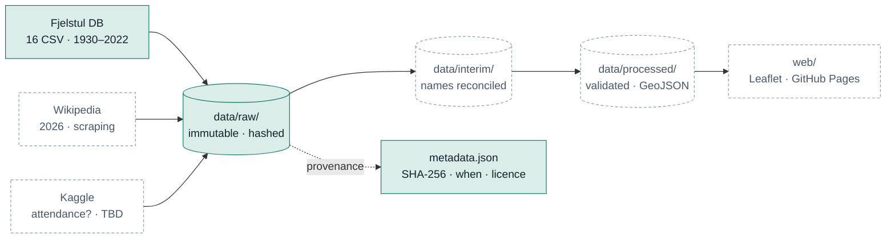

# Atlas Copa do Mundo — World Cup Atlas

An interactive map of every FIFA World Cup, 1930–2026, built as an end-to-end data
pipeline: extraction (including web scraping), reconciliation of almost a century of
inconsistent records, relational modelling, validation, and publication.

*Documentação de planejamento em português: [`plano-atlas-copa-mundo.md`](plano-atlas-copa-mundo.md)*

> ### Status: stage 1 of 5
> Extraction works and is reproducible. **The map does not exist yet**, and the 2026
> tournament is not in the dataset. This README describes what is built, not what is
> planned — see [Roadmap](#roadmap) for the gap.

---

## What this repository actually contains today

| | |
|---|---|
| **Working** | A reproducible extraction pipeline with cryptographic provenance |
| **Data on hand** | 1,248 matches across 30 tournaments (22 men's 1930–2022, 8 women's 1991–2019) |
| **Not built yet** | Cleaning, modelling, geocoding, the map itself |
| **Missing data** | The 2026 tournament — no public dataset covers it |

---

## Quickstart

The raw data is **not** in this repository. That is deliberate: it is reproducible
from the code, and reproducing it is verifiable. Clone, install, extract:

```bash
git clone https://github.com/alaindelon96/atlas-copa-mundo.git
```

```bash
pip install -r requirements.txt
```

```bash
python -m etl.extract
```

That downloads 16 CSVs (~1.9 MB) into `data/raw/fjelstul/` and writes a provenance
record to `data/raw/metadata.json`.

To check whether the upstream source has changed since your last download, without
overwriting anything:

```bash
python -m etl.extract --check
```

**This has been verified**: a fresh clone followed by `python -m etl.extract`
reproduces all 16 files with SHA-256 hashes identical to the committed provenance
record. The data is not stored; it is *regenerable*, and the hashes prove the
regeneration is byte-identical.

---

## How the pipeline works

Data flows in one direction only. Nothing ever writes backwards into a folder to its
left — that single constraint is what makes the whole thing reproducible.



### Stage 1 — Extract ✅

Downloads the source CSVs once, stores them untouched, and records exactly where each
came from.

| Module | Responsibility |
|---|---|
| [`etl/paths.py`](etl/paths.py) | Every path resolved from the repo root, so any module works regardless of the working directory |
| [`etl/provenance.py`](etl/provenance.py) | SHA-256, UTC timestamp, URL, licence and attribution for each file |
| [`etl/extract.py`](etl/extract.py) | The download itself |

Three decisions here are worth explaining, because they are the difference between a
script and a pipeline:

- **`data/raw/` is immutable.** Nothing in it is ever hand-edited, and it is
  `.gitignore`d — but `metadata.json` *is* committed. The data is disposable; the
  audit record is not.
- **Writes are atomic.** Each file lands as `.part` and is renamed only on success. An
  interrupted download cannot leave a truncated CSV that looks valid.
- **Everything is hashed.** `--check` compares the remote hash against the recorded one
  without overwriting, so you can detect upstream changes. This is the hook that makes
  scheduled automation possible later.

### Stages 2–5 — not yet built

Cleaning, modelling/validation/geocoding, the Leaflet map, and publication. See
[Roadmap](#roadmap).

---

## What the data revealed

Four things surfaced on first inspection that changed the original plan. They are the
most interesting part of this project so far.

**1. `tournament_id` does not separate the men's and women's tournaments.**
All 30 editions use the same `WC-<year>` pattern — `WC-1991` is the women's tournament,
`WC-1994` the men's. Only `tournament_name` distinguishes them. Because the years never
overlap and the ID is genuinely unique, grouping by ID silently blends two competitions
and raises no error. An explicit `competition` column is the first thing stage 2 will add.

**2. There is no attendance data.** `matches.csv` has 36 columns and none is attendance,
though `stadium_capacity` is complete across all 240 stadiums. Still an open decision —
see below.

**3. Geocoding cannot be done by hand.** The plan assumed "a few cities". It is 240
stadiums across 202 cities. That is `geopy`/Nominatim with an on-disk cache, not a
spreadsheet.

**4. The data is clean — so the hard problem is a different one.** Zero nulls in dates,
venues, scores and capacities. The work is therefore not repair but **historical
reconciliation**:

| In the data | Today | Change | Solvable by fuzzy matching? |
|---|---|---|---|
| West Germany / East Germany | Germany | Reunification, 1990 | Partly |
| Soviet Union | Russia | Dissolution, 1991 | **No** |
| Yugoslavia → Serbia and Montenegro | Serbia | Staged dissolution | Partly |
| Czechoslovakia | Czech Republic | Split, 1993 | Partly |
| Dutch East Indies | Indonesia | Independence, 1949 | **No** |
| Zaire | DR Congo | Renaming, 1997 | **No** |

This is precisely where `rapidfuzz` alone fails: *Zaire* and *DR Congo* share no textual
similarity. The solution is a curated succession map for the political changes, with
fuzzy matching reserved for spelling variants — and the reasoning documented, because
the choice is editorial rather than technical.

---

## Layout

```
etl/                     pipeline modules (paths, provenance, extract)
data/raw/                immutable source data — gitignored
data/raw/metadata.json   provenance ledger — committed
data/interim/            partial transformations — disposable
data/processed/          final tables, ready for the front-end
web/                     Leaflet map + its GeoJSON
docs/roadmap.html        visual roadmap (bilingual PT/EN)
tests/                   pytest suite for transformation logic
```

---

## Open decisions

Both are judgement calls, not technical blockers, and each gates a stage:

- **Attendance or capacity?** Real attendance requires a Kaggle source that stops at
  2018, leaving 2022 and 2026 blank. Stadium capacity is complete and consistent but is
  a different measure and would need to be labelled honestly. *Gates the map popups.*
- **Does Germany have 4 titles or 1?** Whether West Germany folds into Germany. Both
  answers are defensible; not documenting the choice is not. *Gates stage 2.*

---

## Roadmap

| Stage | Status |
|---|---|
| 1 · Extract ready-made datasets | ✅ Done |
| 1b · Scrape the 2026 tournament | ⬜ Not started |
| 2 · Clean and reconcile names | ⬜ Blocked on the succession decision |
| 3 · Model, validate, geocode | ⬜ Not started |
| 4 · Build the Leaflet map | ⬜ Not started |
| 5 · Publish to GitHub Pages | ⬜ Not started |

A bilingual visual roadmap with the reasoning behind each stage is in
[`docs/roadmap.html`](docs/roadmap.html).

> **A note on 2026.** The planning documents record that the 2026 tournament ended on
> 19 July 2026. That has **not** been verified by any source inside this project. When
> the scraper is written, the scraped data — not the note — is the authority.

---

## Licensing and attribution

This repository is under **two** licences, because the code and the data have different
origins.

| | Licence | |
|---|---|---|
| **Code** (`etl/`, `web/`, `tests/`) | MIT | [`LICENSE`](LICENSE) |
| **Data** (`data/`, `web/data/`) | CC BY-SA 4.0 | [`LICENSE-DATA.md`](LICENSE-DATA.md) |

The data licence is not a choice. The source is published under CC BY-SA 4.0, whose
ShareAlike term requires derived data to carry the same licence.

> GitHub's sidebar detects a single licence and will display **MIT**. That label
> applies to the code only — the data is CC BY-SA 4.0 regardless of what the sidebar
> says.

### Required attribution

All World Cup data in this repository comes from the **Fjelstul World Cup Database**:

- **Author:** Joshua C. Fjelstul, Ph.D.
- **Copyright:** © 2023 Joshua C. Fjelstul, Ph.D.
- **Licence:** [CC BY-SA 4.0](https://creativecommons.org/licenses/by-sa/4.0/legalcode)
- **Source:** https://www.github.com/jfjelstul/worldcup

> Fjelstul, Joshua C. "The Fjelstul World Cup Database v.1.2.0." July 19, 2023.
> https://www.github.com/jfjelstul/worldcup.

**Modifications:** the files in `data/raw/fjelstul/` are byte-for-byte identical to the
source — 16 of the 29 published tables were retrieved, none altered. Derived data does
not exist yet. A full modification record is maintained in
[`LICENSE-DATA.md`](LICENSE-DATA.md), as the licence requires.

The database is provided by its author as-is, with no warranties of any kind.

### Built with

[pandas](https://pandas.pydata.org/) ·
[pandera](https://pandera.readthedocs.io/) ·
[rapidfuzz](https://github.com/rapidfuzz/RapidFuzz) ·
[geopy](https://geopy.readthedocs.io/) ·
[requests](https://requests.readthedocs.io/) ·
[Leaflet](https://leafletjs.com/)
