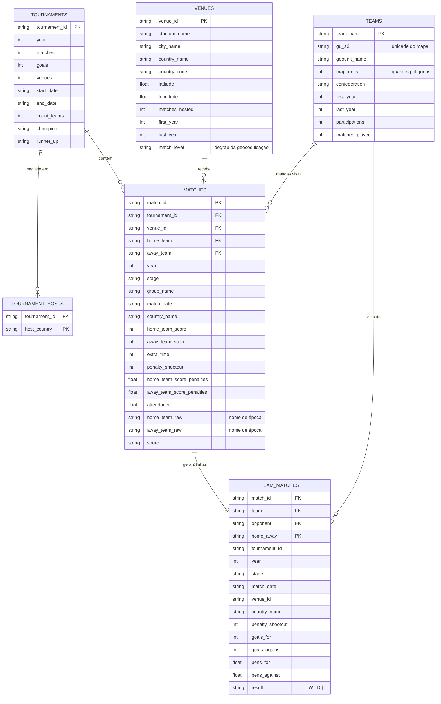

# Esquema do Atlas da Copa do Mundo

> Etapa 3 do ETL. Gerado por `python -m etl.model` em `data/processed/`;
> validado por `python -m etl.validate`. Última revisão: 08/08/2026.

Seis tabelas, 1.068 partidas, 1930–2026. O que segue é o esquema e, mais
importante, **por que ele tem essa forma** — cada decisão aqui foi imposta por
alguma coisa que o dado fez.

## Escopo: Copa masculina

O modelo cobre as 23 edições masculinas. A Copa feminina **continua no dado** —
`data/raw/` e `data/processed/matches_clean.csv` seguem com as 284 partidas de
1991–2019 e com a coluna `competition` que as identifica — mas está fora do
produto: do modelo, do mapa e dos JSONs.

O recorte é feito em **um lugar só**, a constante `COMPETITION` em `etl/model.py`.
Por isso as tabelas abaixo não têm coluna `competition`: ela teria um único valor
em 1.068 linhas, e uma coluna constante não informa nada — só sugere uma variação
que não existe. Reincluir o feminino é mudar aquela constante e devolver a coluna
às tabelas.

## Diagrama



## As decisões que deram esta forma ao esquema

### 1. País-sede é uma tabela, não uma coluna

O Fjelstul guarda o país-sede em `tournaments.host_country`, uma coluna só. Nas
duas edições com mais de um país, ele improvisa — e improvisa diferente a cada
vez:

| Edição | Como a fonte declara | O que o modelo deriva |
|---|---|---|
| 2002 | `"Korea, Japan"` | `Japan`, `South Korea` |
| 2026 | `"Canada Mexico United States"` | `Canada`, `Mexico`, `United States` |

Uma com vírgula, outra sem separador nenhum — e `"Korea"` é um nome que não
aparece em nenhum outro lugar do dataset (`teams.csv` diz `South Korea`).
Interpretar essas strings seria escrever um parser para duas linhas, e ele
quebraria na terceira.

`tournament_hosts` é **derivada das sedes onde as partidas de fato ocorreram**.
Onde se jogou é um fato registrado partida a partida; a string declarada vira
conferência, impressa a cada execução de `etl.model`.

### 2. `gu_a3` é a chave do mapa — e não é ISO

O mapa é coroplético e a base é o **`admin_0_map_units`** do Natural Earth, não
o `admin_0_countries`. A diferença decide o projeto: `map_units` separa o Reino
Unido em Inglaterra, Escócia, País de Gales e Irlanda do Norte, que é o recorte
que o futebol usa. `ENG`, `SCT`, `WLS` e `NIR` não são códigos ISO de país —
são códigos de unidade de mapa, e é por isso que a coluna se chama `gu_a3` e
não `iso_a3`.

O preço aparece na Bélgica: a mesma divisão a separa em Flandres, Valônia e
Bruxelas. O mapeamento `reference/team_country.csv` é, por isso,
**um-para-muitos** — a Bélgica ocupa três linhas. O mapa nunca dissolve
polígonos; as três recebem a mesma cor e a costura não aparece. `teams.map_units`
registra quantos polígonos cada seleção ocupa: 1 para 82 seleções e 3 para a
Bélgica — 85 polígonos ao todo, para 83 seleções.

### 3. `team_matches` é redundante de propósito

Ela é `matches` dobrada: uma linha por (partida, seleção). Toda informação nela
já existe em `matches` — e é exatamente por isso que existe. Quase toda métrica
do mapa quer uma linha por seleção, e refazer essa dobra em cada agregação é o
jeito clássico de contar só os mandantes e não perceber.

A coluna `result` mora aqui, e não é o placar: **no mata-mata um 1–1 não é
empate**, alguém avançou nos pênaltis. Derivar o resultado do placar criaria
empates que não existiram e tiraria vitórias de quem passou.

A chave é `(match_id, home_away)` e não `(match_id, team)`. A exceção que obriga
isso é uma só, em 1974 — ver abaixo.

### 4. Nome de época e rótulo moderno convivem

`matches` carrega `home_team_raw` / `away_team_raw` (o nome como o dado de época
o registra: `West Germany`, `Zaire`, `Soviet Union`) e `home_team` / `away_team`
(o rótulo atual). Nada é sobrescrito: a reconciliação é uma coluna nova, não uma
edição.

**Decisão do projeto (08/08/2026, reafirmada na Etapa 3): o rótulo manda.** Quem
é rotulado como Alemanha soma como Alemanha. A consequência aparece uma vez, e
o modelo a expõe em vez de escondê-la:

> **M-1974-20 — Alemanha Oriental 1–0 Alemanha Ocidental.** Com os dois rótulos
> resolvendo para `Germany`, a partida vira `Germany × Germany`. A Alemanha soma
> uma vitória e uma derrota, um gol feito e um sofrido: todos os totais
> continuam fechando, e nenhuma contagem de título muda. `etl.validate` imprime
> esse caso a cada execução, e `tests/test_model.py` o trava — para que a
> escolha continue sendo uma escolha visível, e não algo que alguém "conserta"
> sem saber que está mexendo numa decisão editorial.

### 5. Ausência é ausência — não é zero, nem string

As duas fontes discordam sobre como dizer "isto não se aplica", e discordam de
duas maneiras diferentes. As duas foram encontradas pelo `pandera`, não a olho:

| Coluna | Fjelstul diz | Wikipédia diz | Linhas na tabela limpa | …das quais, no escopo |
|---|---|---|---|---|
| placar de pênaltis, sem disputa | `0` e `0` | vazio | 1.205 | 929 |
| `group_name`, no mata-mata | `"not applicable"` | vazio | 332 | 252 |

As duas últimas colunas separam a fonte do produto: a contagem maior é sobre
`matches_clean.csv` (1.352 partidas, as duas competições), a menor sobre o que o
modelo carrega. O defeito é da fonte e existiria de qualquer jeito.

Nenhuma das duas quebra nada — é esse o problema. Um `0` é um placar válido, e
um `groupby("group_name")` devolveria alegremente um "grupo" chamado
`not applicable` com 332 partidas de mata-mata dentro. No modelo, o placar de
pênaltis existe se, e somente se, `penalty_shootout = 1` (39 partidas), e
`group_name` só existe na fase de grupos (784 de 1.068).

### 6. `match_level` diz de onde veio cada coordenada

A geocodificação desce em degraus: `estádio, cidade, país` → `cidade, país` →
`estádio, cidade` (este último para as 16 sedes de 2026, onde o país era
justamente o que se queria descobrir). A coluna registra qual degrau respondeu:

| Degrau | Sedes | Significa |
|---|---|---|
| `stadium+country` | 189 | coordenada do estádio |
| `city+country` | 51 | coordenada da **cidade** — o estádio não foi encontrado |
| `stadium` | 12 | estádio de 2026, buscado sem país |

Quem for desenhar um marcador precisa saber que 51 deles apontam para o centro
da cidade, não para o gramado. Sem a coluna, as 252 linhas pareceriam
igualmente precisas.

## O que o mapa consome — só estatística de jogo

Decisão de 08/08/2026. Toda métrica exposta vem do que aconteceu **em campo**. Nada
depende de público nem de capacidade de estádio.

`web/data/metrics.json` — uma entrada por seleção:

| Campo | O quê |
|---|---|
| `goals` · `conceded` · `goal_difference` | gols feitos, sofridos e saldo |
| `wins` · `draws` · `losses` · `win_pct` | resultado, com pênaltis já resolvidos |
| `matches_played` | partidas disputadas |
| `matches_received` | partidas recebidas como país-sede |
| `titles` | títulos, vindos das classificações finais |
| `participations` · `first_year` · `last_year` | presença ao longo do tempo |
| `goals_per_match` · `conceded_per_match` · `wins_per_match` | as mesmas leituras por partida, nulas abaixo do piso de 10 |
| `gu_a3` | a chave que casa com o polígono do GeoJSON |

`web/data/head2head.json` — os mesmos números contra **um** adversário
(`{seleção: {adversário: {goals, conceded, matches, wins, draws, losses}}}`), que é o
que o modo de país selecionado pinta.

**Por que público e capacidade ficaram de fora.** Os dois exigiriam uma ressalva colada
em cada número: público existe em 104 das 1.068 partidas, e capacidade é completa mas
**muda com o tempo** — o Azteca tinha 115.000 em 1970 e tem 80.824 em 2026, 34.176 de
diferença numa coluna que só cabe um valor. Estatística de jogo não tem nenhum dos dois
problemas: é completa nas 1.068 partidas e significa a mesma coisa em 1930 e em 2026.

A coluna `attendance` continua em `matches.csv` — é um fato que a fonte dá, e descartá-la
jogaria fora o único lugar onde ele existe. Ela apenas não alimenta métrica nenhuma.
Capacidade nunca foi juntada ao modelo: omissão deliberada, não esquecimento.

## Colunas majoritariamente nulas — e por quê

| Coluna | Nulos | Motivo |
|---|---|---|
| `matches.attendance` | 964 de 1.068 | O Fjelstul não tem público em nenhuma edição; a Wikipédia tem nas 104 partidas de 2026. É origem, não erro — e a coluna **não alimenta nenhuma métrica** (ver abaixo). |
| `matches.group_name` | 284 de 1.068 | Só a fase de grupos tem grupo. |
| `matches.*_score_penalties` | 1.029 de 1.068 | Só as 39 partidas decididas nos pênaltis. |

## Como reproduzir

```bash
python -m etl.extract && python -m etl.scrape_2026 && python -m etl.parse_2026
```

```bash
python -m etl.transform && python -m etl.geocode --offline && python -m etl.geo
```

> A ordem importa: `etl.geo` produz o `reference/team_country.csv` que `etl.model`
> consome.

```bash
python -m etl.model && python -m etl.validate && python -m etl.metrics
```

`--offline` usa o cache de geocodificação versionado em
`data/interim/geocode_cache.json` e não toca na rede. Sem ele, são ~5 minutos de
requisições ao Nominatim, a 1 por segundo.
